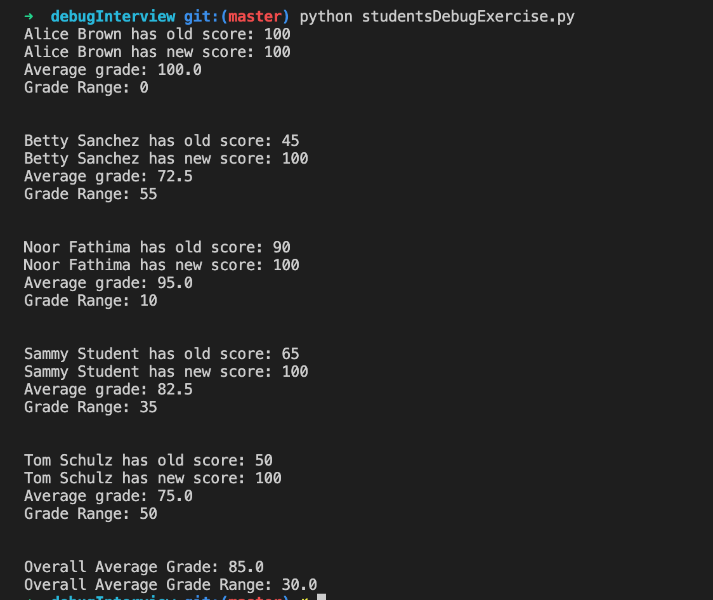

# debugInterview

Simple Project that you have to debug and fix the bugs that it contains. 
## Project Overview: 

This is a very simple project which has the logic to process grades of various students from a file.

The Student Class creates various student objects (a list of objects for keeping the code simple) that will be used to process scores from a given file. Each student score is read in from `data.txt` file and cross-checked against an key in `answer.txt` file. The outcome of the class will show the processed scores for each student object by displaying each score result for each student by name. The files actually will be read into lists, then compared by each students responses with the corresponding answer key responses.

The final output is shown in the image below: 

)

## Exercise: 

- This project has 14 very simple `unique bugs` in it that you need to debug and fix. 
- Note: A same bug can repeat more than one time in different places. 
- These bugs are very straight forward and all the concepts are from the Python Tutorial and OOP chapter of the python-course.eu. 
- You have to find the bugs one after the other and fix them until you get the output like in the above image. 
- After you finish it take an image of your output which matches the output in the above image and add it to the Solution.md file.

## Bonus: (Not a "MUST" requirement) 

In the Solution.md, write all the bugs and explain them in 1-2 lines.  

